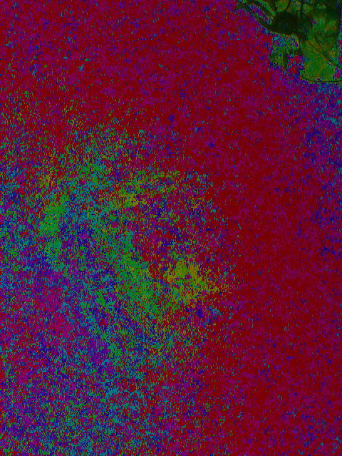
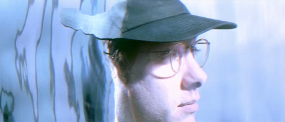

# Z-Pixel (draft)

ZPixel is a research project which allows to experience though advanced math tools the virtual holographic pixel
that allows to see more and beyond. It's a journey, enjoy it :)



The above tomography comes from a video recorded with a simple webcam (`SPCA2650 PC Camera`) in front of a the white
wall, my hypothesis is that we can use the light as a fluid that contains in its ripples holographic information in which we can look
and observe objects and environments that exist as radio emissions or manifestations that are related to other frequencies. It seems
in fact that the light, our ultra sensible fluid, which is influenced by interior lighting frequencies and environmental
conditions of the room allow us to observe in its ripples and study variations that could highlight coexisting shapes and environments in other
ravines of the universal hologram.

Ok, now I am thinking to him :)



## Usage

This is a normal sbt project. You can compile code with `sbt compile`, run it with `sbt run`, and `sbt console` will
start a Scala 3 REPL.

This program works with huge data structures that need to be kept in memory, so if you want to experience
this software probably you have to allocate the right quantity for the heap that your data needs;
for example you can run through SBT with the command `sbt -J-Xmx8G run` that in this case starts the JVM with
8 GB of heap.

## Workflow
The following commands help us to record from camera, prepare frames for processing and build the final video.

### 0. File-System
Let's prepare our local `data` directory structure in order to store input frames or the program output tomography.

 `mkdir -p data/exp_0/{i/frames,o}`

At the moment the program expects the following directory structure:
```
data                  => Data directory for all experiments
 └── exp_0            => Experiment directory (customizable)
      ├── i           => Input directory to store recorded video and frames 
      │   └── frames  => Video frames to process
      └── o           => Output directory
          └── frames  => Output video frames (currently unused)
```
you can choose a custom name for the experience directory but, for now keep the rest of the structure.

You also must to manually store input data frames to process, you can use `ffmpeg` to record from a camera device
and to extract frames; thanks for the patience.

### 1. Recording
With the following command we can record from the specified video input device:

`ffmpeg -f v4l2 -framerate 30 -t 20 -video_size 640x480 -i /dev/video0 -c:v rawvideo -pix_fmt yuv422p i/rec.avi`

### 2. Frames extraction
Let's use the following command to extract frames from the recorded video:

`ffmpeg -i rec.avi -vsync 0 -frame_pts 1 i/frames/f_%06d.png`

### 3. Z-Processing
In this phase we have to edit the implementation of `dev.zpixel.ZPixel#experiment` in order to let the program to know
in which directory have to work. Let's run the program to process frames and produce the tomography:

`sbt -J-Xmx8G run`

### +. Plus, making video from frames (currently not needed)
To make a video we can run the following command:

`ffmpeg -framerate 30 -i o/frames/f_%03d.png -c:v rawvideo -pix_fmt rgb24 o/out.avi`